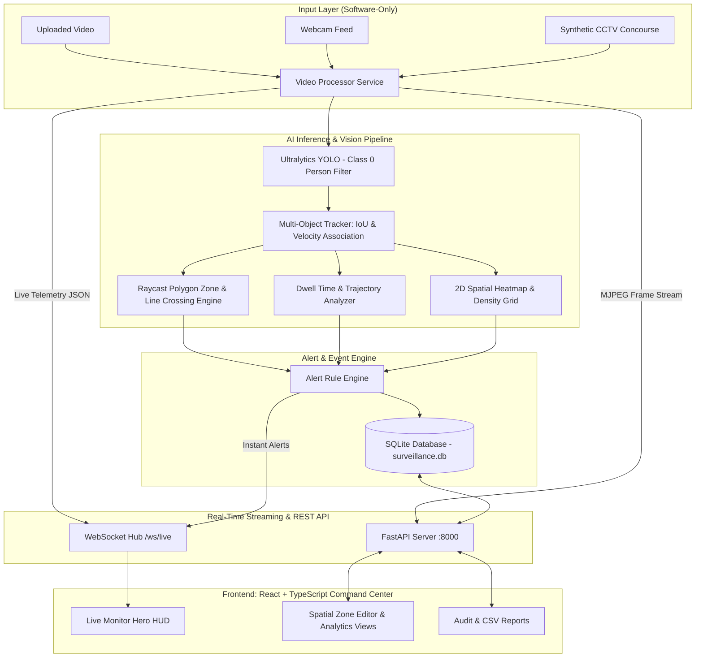

# AegisVision AI — Anonymous Surveillance & Crowd Analytics Command Center

[](https://python.org)
[](https://fastapi.tiangolo.com)
[](https://react.dev)
[](https://www.typescriptlang.org)
[](https://ultralytics.com)
[](#privacy-first-architecture)
[](#windows-development-setup)

A commercial-grade, real-time AI surveillance and anonymous crowd intelligence platform built with **FastAPI**, **Ultralytics YOLO**, **OpenCV**, and a **React + TypeScript** dark-themed Command Center interface.

Designed for edge computing, commercial facilities, transit terminals, and retail analytics **without dedicated CCTV hardware or biometric facial recognition**.

---

## Architecture Overview



---

## Core Capabilities & Features

### 1. Real-Time Vision & Anonymous Multi-Object Tracking
- **Zero-Biometrics Privacy**: Strictly assigns ephemeral anonymous tokens (e.g. `Person #1`, `Person #17`). No facial recognition, facial landmark vectors, or identity tracking.
- **Lightweight Inference**: Runs YOLOv8n optimized for standard laptop CPU or CUDA GPU acceleration.
- **Persistent Trajectories**: Tracks ground-plane footpoints and movement vectors across frames with missed-detection tolerance.

### 2. Spatial Perimeter Zones & Virtual Tripwires
- **Polygon Security Zones**: Ray-casting point-in-polygon algorithm calculating real-time occupancy and capacity compliance.
- **Virtual Tripwires (Lines)**: 2D vector segment intersection determining directional line crossings (`IN` vs `OUT`).
- **Interactive Zone Studio**: In-browser drawing canvas to create, resize, and configure zone capacities and loitering thresholds.

### 3. Behavioral Crowd Analytics & 2D Heatmaps
- **Crowd Congestion Index**: Computes normalized crowd density relative to space limits.
- **Loitering & Dwell Detection**: Tracks exact residency duration inside defined security perimeters.
- **2D Congregational Heatmap**: Accumulates Gaussian footpoint footprints rendering thermal congregational hotspots.

### 4. Alert & Debounce Engine
- **Capacity Overload**: Fires warnings or critical alerts when zone or overall room capacity is breached.
- **Loitering Alarms**: Flags persons dwelling longer than configured threshold seconds.
- **Perimeter Trips**: Instant notification when a restricted tripwire line is breached.
- **Debounce / Cooldown Logic**: Prevents notification spamming by deduplicating alerts over configurable intervals.

### 5. Professional AI Command Center UI
- **Dark AI Operations Aesthetics**: Charcoal panels, cyan/electric blue accents, amber warnings, and red incident states.
- **Live Telemetry Hero HUD**: Real-time FPS, inference latency in milliseconds, current occupants, and peak count.
- **Export & Audit Suite**: Downloads session telemetry in CSV and JSON, with printable compliance summaries.

---

## Tech Stack

| Component | Technology | Description |
|---|---|---|
| **Backend Framework** | FastAPI | High-speed async REST endpoints and WebSocket server |
| **Vision Model** | Ultralytics YOLOv8 | Lightweight person detection model (`yolov8n.pt`) |
| **Video Engine** | OpenCV Headless | Video decode, annotation overlay rendering, MJPEG streaming |
| **Database** | SQLite + SQLAlchemy | Embedded persistence for sessions, zones, alerts, and analytics |
| **Frontend Framework** | React 18 + TypeScript | Type-safe single-page application |
| **Build Tool** | Vite 5 | Instant HMR development server and production bundler |
| **Icons** | Lucide React | Modern, clean vector iconography |
| **Styling** | Vanilla CSS Tokens | Dark command center theme with zero external bloat |

---

## Quick Start on Windows

### Option 1: One-Click Launcher (`start-dev.bat`)
Double-click `start-dev.bat` in the project root:
```bat
start-dev.bat
```
This batch script will automatically:
1. Create a Python 3.13 virtual environment (`venv`) if not present.
2. Install/update backend dependencies.
3. Install frontend npm dependencies.
4. Launch the FastAPI backend on `http://127.0.0.1:8000`.
5. Launch the React Command Center on `http://localhost:5173`.

---

### Option 2: Manual Setup

#### 1. Backend Setup
```powershell
# In project root:
py -3.13 -m venv venv
.\venv\Scripts\activate
pip install -r backend\requirements.txt

# Run backend
python -m uvicorn backend.app.main:app --host 127.0.0.1 --port 8000 --reload
```

#### 2. Frontend Setup
```powershell
# In another terminal:
cd frontend
npm install
npm run dev
```
Open **`http://localhost:5173`** in your browser.

---

## Project Structure

```
ai_surveillance/
├── backend/
│   ├── app/
│   │   ├── ai/
│   │   │   ├── alert_engine.py    # Alert evaluator & cooldown debounce
│   │   │   ├── analytics.py       # Density index & 2D heatmap accumulator
│   │   │   ├── detector.py        # Ultralytics YOLO person detector
│   │   │   ├── tracker.py         # Multi-object tracker & trajectory history
│   │   │   └── zones.py           # Point-in-polygon & tripwire intersection
│   │   ├── api/
│   │   │   ├── routes_alerts.py   # Alert querying & acknowledgement
│   │   │   ├── routes_analytics.py# Historical telemetry, heatmap, & CSV exports
│   │   │   ├── routes_sessions.py # Video upload, webcam, sample, MJPEG stream
│   │   │   ├── routes_settings.py # Tunable thresholds and model params
│   │   │   ├── routes_zones.py    # Zone & tripwire CRUD
│   │   │   └── websocket.py       # Real-time /ws/live broadcast hub
│   │   ├── models/                # SQLAlchemy database models
│   │   ├── schemas/               # Pydantic schemas
│   │   ├── services/
│   │   │   ├── sample_generator.py# Generates synthetic surveillance concourse
│   │   │   └── video_processor.py # Master async video ingestion worker
│   │   ├── config.py              # Environment configuration & directories
│   │   ├── database.py            # Engine & session maker
│   │   └── main.py                # FastAPI entrypoint
│   ├── tests/                     # Pytest automated test suite
│   └── requirements.txt
├── frontend/
│   ├── src/
│   │   ├── components/            # Header, Sidebar, StatCard
│   │   ├── hooks/                 # useSurveillanceWebSocket hook
│   │   ├── pages/
│   │   │   ├── AlertsPage.tsx     # Filterable incident audit log
│   │   │   ├── AnalyticsPage.tsx  # Timeline charts & 2D Heatmap
│   │   │   ├── LiveMonitorPage.tsx# Command Center HERO live stream HUD
│   │   │   ├── ReportsPage.tsx    # Compliance report & CSV/JSON export
│   │   │   ├── SessionsPage.tsx   # Video upload, sample, and webcam launcher
│   │   │   ├── SettingsPage.tsx   # Neural inference & threshold controls
│   │   │   └── ZoneEditorPage.tsx # Interactive canvas zone designer
│   │   ├── services/api.ts        # REST API client
│   │   ├── types/index.ts         # TypeScript interfaces
│   │   ├── App.tsx
│   │   ├── index.css              # Master command center theme
│   │   └── main.tsx
│   ├── package.json
│   ├── tsconfig.json
│   └── vite.config.ts
├── uploads/                       # Ingested and sample video footage
├── start-dev.bat                  # One-click Windows development launcher
└── README.md
```

---

## Privacy-First Architecture

> **Privacy Notice**: This software is strictly built for non-intrusive crowd density estimation, safety compliance, and perimeter security.
- **No Face Recognition**: Face embeddings, facial databases, or matching engines are intentionally omitted.
- **Anonymous IDs**: Every individual is identified only as `Person #N` during their stay in camera view.
- **Local Execution**: All vision processing executes entirely on the local machine with no external cloud API dependencies.

---

## Verification & Testing

To run automated backend tests:
```powershell
.\venv\Scripts\activate
pytest backend\tests\
```
To run frontend type check and production bundle verification:
```powershell
cd frontend
npm run build
```

---

## Known Limitations & Future Roadmap
- **RTSP Ingestion**: Currently supports video upload, synthetic CCTV, and local webcams; future updates will add direct H.264/H.265 RTSP IP camera decoding.
- **Multi-Camera Handover**: Future roadmap includes cross-camera feature re-identification using anonymous appearance color histograms.
