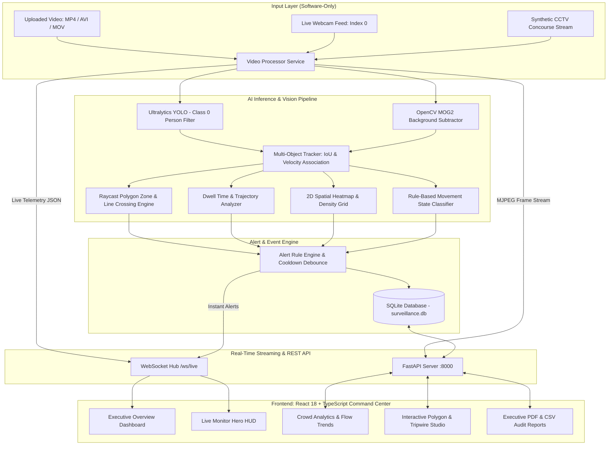

# SentinelVision AI — Real-Time Crowd Surveillance & Analytics Platform

[](https://python.org)
[](https://fastapi.tiangolo.com)
[](https://react.dev)
[](https://www.typescriptlang.org)
[](https://ultralytics.com)
[](https://recharts.org)
[](#privacy-first-architecture)
[](#quick-start-on-windows)

A commercial-grade, real-time AI surveillance and anonymous crowd intelligence platform built with **FastAPI**, **Ultralytics YOLO**, **OpenCV**, and a **React 18 + TypeScript + Recharts** dual-theme Command Center interface.

Designed for edge computing, transit terminals, commercial facilities, and retail safety **without dedicated CCTV hardware or biometric facial recognition**.

---

## Architecture Overview



---

## Core Capabilities & Features

### 1. Real-Time Vision & Anonymous Multi-Object Tracking
- **Zero-Biometrics Privacy**: Strictly assigns ephemeral anonymous tokens (e.g. `Person #1`, `Person #17`). No facial recognition, facial landmark vectors, or identity tracking.
- **Lightweight Inference**: Runs YOLOv8n optimized for standard laptop CPU or CUDA GPU acceleration.
- **Persistent Trajectories**: Tracks ground-plane footpoints and movement vectors across frames with missed-detection tolerance.
- **Movement State Classification**: Rule-based tracking of `STATIONARY`, `WALKING`, `FAST MOVEMENT`, and `UNUSUAL MOVEMENT`.

### 2. Spatial Perimeter Zones & Virtual Tripwires
- **Polygon Security Zones**: Ray-casting point-in-polygon algorithm calculating real-time occupancy and capacity compliance.
- **Virtual Tripwires (Lines)**: 2D vector segment intersection determining directional line crossings (`IN` vs `OUT`).
- **Interactive Zone Studio**: In-browser vector drawing canvas to create, resize, and configure zone capacities and dwell thresholds.

### 3. Behavioral Crowd Analytics & 2D Heatmaps
- **Crowd Congestion Index**: Computes physical density (`people / m²`) based on configured monitored floor area.
- **Crowd Levels**: Dynamic states (`LOW`, `MEDIUM`, `HIGH`, `CRITICAL`) with configurable limits.
- **Loitering & Dwell Detection**: Tracks exact residency duration inside defined security perimeters.
- **2D Congregational Thermal Heatmap**: Accumulates Gaussian footpoint footprints rendering thermal density hotspots.
- **Automated Real Insights**: Generates automated statistical narrative insights from real session data.

### 4. Alert & Anti-Spam Debounce Engine
- **Capacity Overload**: Fires warnings or critical alerts when zone or room capacity is breached.
- **Loitering Alarms**: Flags persons dwelling longer than configured threshold seconds.
- **Restricted Area Intrusion**: Instant notifications when an unauthorized perimeter is entered.
- **Anti-Spam Debounce**: Configurable alert cooldown intervals (e.g. 5s) to eliminate duplicate alert spam.
- **Web Audio Chimes**: Synthesized soft audio alerts toggled in the interface.

### 5. Professional AI Command Center UI
- **Dual Theme Support**: Dark AI Operations Command Center (default) and crisp Light Mode with persistent preference.
- **Overview Dashboard**: Hero KPI metrics, live mini-monitor, real-time Recharts flow curves, zone occupancy bars, and incident feed.
- **Live Monitor Page**: Large video canvas overlay, latency HUD (FPS & inference latency in ms), snapshot capture, and overlay controls.
- **Compliance & Audit Reports**: Executive printable PDF reports with `@media print` optimization, CSV data summaries, and raw JSON telemetry.

---

## Tech Stack

| Component | Technology | Description |
|---|---|---|
| **Backend Framework** | FastAPI (Python 3.13) | High-speed async REST endpoints and WebSocket server |
| **Object Detection** | Ultralytics YOLOv8 (`yolov8n.pt`) | Real-time lightweight person detection (Class 0) |
| **Computer Vision** | OpenCV Headless | Video decode, annotation overlay rendering, MJPEG streaming |
| **Database** | SQLite + SQLAlchemy | Embedded persistence for sessions, zones, alerts, and analytics |
| **Frontend Framework** | React 18 + TypeScript | Type-safe single-page application |
| **Visualization** | Recharts 3.10 | Real-time Area, Bar, and Line charts |
| **Build Tool** | Vite 5 | Instant HMR development server and production bundler |
| **Icons** | Lucide React | Modern vector iconography |
| **Styling** | Vanilla CSS Tokens | Dark/Light command center theme with zero external CSS bloat |

---

## Quick Start on Windows

### Option 1: One-Click Windows Launcher (`start-dev.bat`)
Double-click [`start-dev.bat`](file:///d:/projects/ai_surveillance/start-dev.bat) or [`start-dev.ps1`](file:///d:/projects/ai_surveillance/start-dev.ps1) in the project root:
```bat
start-dev.bat
```
This batch script will automatically:
1. Create a Python 3.13 virtual environment (`venv`) if not present.
2. Install/update backend dependencies.
3. Install frontend npm dependencies.
4. Launch the FastAPI backend on `http://127.0.0.1:8000`.
5. Launch the React Command Center on `http://localhost:5173`.

---

### Option 2: Manual PowerShell Setup

#### 1. Backend Setup
```powershell
# In project root:
py -3.13 -m venv venv
.\venv\Scripts\activate
pip install -r backend\requirements.txt

# Run backend
$env:PYTHONPATH="."
python -m uvicorn backend.app.main:app --host 127.0.0.1 --port 8000 --reload
```

#### 2. Frontend Setup
```powershell
# In another terminal:
cd frontend
npm install
npm run dev
```
Open **`http://localhost:5173`** in your browser.

---

## Project Structure

```
ai_surveillance/
├── .env.example                       # Environment configuration template
├── .gitignore                         # Comprehensive ignore rules
├── Dockerfile                         # Production multi-stage container
├── docker-compose.yml                 # Multi-service container specification
├── README.md                          # Platform documentation
├── start-dev.bat                      # One-click Windows batch launcher
├── start-dev.ps1                      # Windows PowerShell launcher
├── docs/
│   └── architecture.md                # In-depth system design & math specification
├── backend/
│   ├── app/
│   │   ├── ai/
│   │   │   ├── alert_engine.py        # Cooldown debounce & event evaluator
│   │   │   ├── analytics.py           # Density index & 2D heatmap accumulator
│   │   │   ├── detector.py            # YOLO & OpenCV MOG2 detection pipeline
│   │   │   ├── tracker.py             # Multi-object tracker & movement classifier
│   │   │   └── zones.py               # Raycasting & line crossing geometry
│   │   ├── api/
│   │   │   ├── routes_alerts.py       # Incident querying & status updates
│   │   │   ├── routes_analytics.py    # Analytics, automated insights & PDF export
│   │   │   ├── routes_sessions.py     # Video upload, sample generator & streaming
│   │   │   ├── routes_settings.py     # Inference threshold configuration
│   │   │   ├── routes_zones.py        # Zone & tripwire CRUD
│   │   │   └── websocket.py           # Real-time /ws/live telemetry broadcast
│   │   ├── models/                    # SQLAlchemy database entities
│   │   ├── schemas/                   # Pydantic data validation schemas
│   │   ├── services/
│   │   │   ├── sample_generator.py    # Synthetic CCTV concourse generator
│   │   │   └── video_processor.py     # Asynchronous video ingestion engine
│   │   ├── config.py                  # Environment paths and configurations
│   │   ├── database.py                # Database session & engine
│   │   └── main.py                    # FastAPI application initialization
│   ├── tests/
│   │   ├── test_api.py                # REST API & disclosure endpoint tests
│   │   ├── test_geometry.py           # Polygon raycast & vector intersection tests
│   │   └── test_tracker.py            # IoU computation & track lifecycle tests
│   └── requirements.txt               # Backend Python dependencies
├── frontend/
│   ├── src/
│   │   ├── components/                # Header, Sidebar, StatCard, Logo
│   │   ├── hooks/                     # WebSocket telemetry hook
│   │   ├── pages/
│   │   │   ├── DashboardPage.tsx      # Overview Command Center HERO dashboard
│   │   │   ├── LiveMonitorPage.tsx    # Dedicated live surveillance HUD & overlays
│   │   │   ├── AnalyticsPage.tsx      # Recharts timeline & 2D thermal heatmap
│   │   │   ├── ZoneEditorPage.tsx     # Vector canvas zone & tripwire studio
│   │   │   ├── AlertsPage.tsx         # Incident audit feed & triage
│   │   │   ├── SessionsPage.tsx       # Video upload & webcam controller
│   │   │   ├── ReportsPage.tsx        # Executive PDF, CSV, and JSON audit export
│   │   │   └── SettingsPage.tsx       # AI inference parameter settings
│   │   ├── services/api.ts            # Frontend REST client
│   │   ├── types/index.ts             # TypeScript domain models
│   │   ├── App.tsx                    # Root routing & layout
│   │   ├── index.css                  # Dark/Light design tokens & utility classes
│   │   └── main.tsx                   # React DOM entry point
│   ├── package.json
│   ├── tsconfig.json
│   └── vite.config.ts
└── uploads/
    └── .gitkeep                       # Directory placeholder for video footage
```

---

## Privacy-First Architecture & Honest Disclosures

> **Privacy Notice**: This software is strictly built for non-intrusive crowd density estimation, safety compliance, and perimeter security.
- **No Face Recognition**: Face embeddings, facial databases, or matching engines are intentionally omitted.
- **Anonymous IDs**: Every individual is identified only as `Person #N` during their stay in camera view.
- **Estimated Crowd Density**: Crowd density is computed as `people / monitored_area` or estimated density index when floor dimensions are unspecified.
- **Movement Anomalies**: Anomaly detection uses rule-based velocity thresholds (`STATIONARY`, `WALKING`, `FAST MOVEMENT`, `UNUSUAL MOVEMENT`) rather than learned behavioral AI.
- **Local Execution**: All vision processing executes entirely on the local machine with no external cloud API dependencies.

---

## Verification & Automated Tests

To run automated backend tests:
```powershell
$env:PYTHONPATH="."
.\venv\Scripts\pytest backend\tests\ -v
```

To run frontend production bundling:
```powershell
cd frontend
npm run build
```
