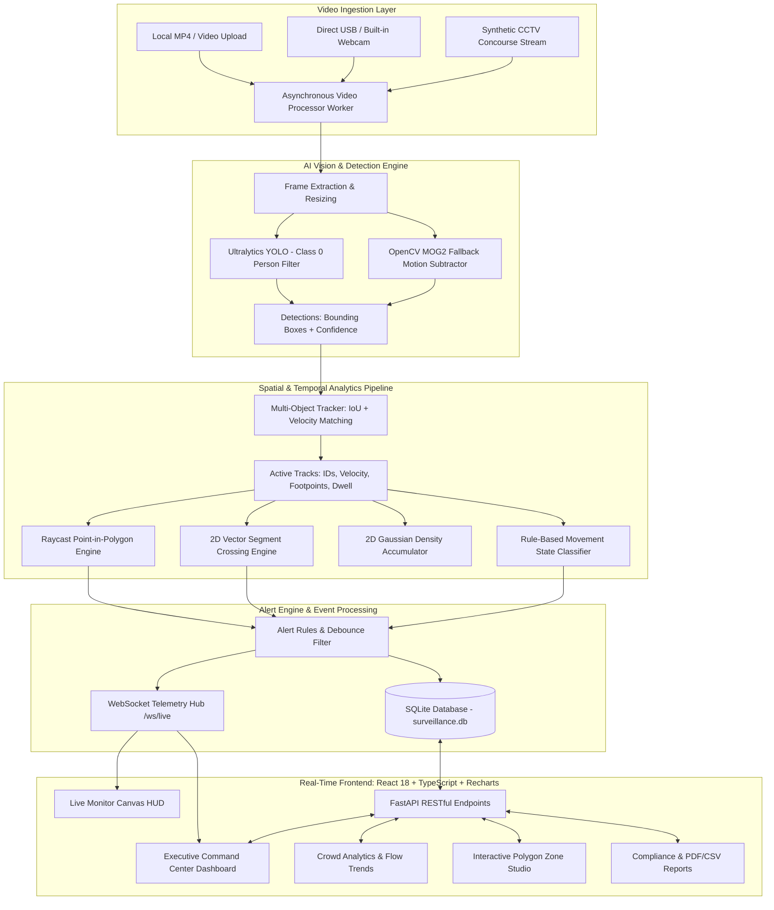

# SentinelVision AI — System Architecture & Design Specification

An enterprise-grade, privacy-first computer vision surveillance and crowd analytics platform designed for local edge deployment, high-throughput spatial telemetry, and sub-50ms latency.

---

## 1. System Architecture & Data Flow

---

## 2. Core Mathematical & Algorithmic Foundations

### 2.1 Multi-Object Tracking & Data Association
The tracker associates bounding boxes between sequential frames $t-1$ and $t$ using **Intersection over Union (IoU)** with velocity projection:

$$\text{IoU}(B_1, B_2) = \frac{\text{Area}(B_1 \cap B_2)}{\text{Area}(B_1 \cup B_2)}$$

Before matching, each track's predicted position is updated using its exponential moving average velocity vector $\mathbf{v} = (v_x, v_y)$:

$$\mathbf{p}_{\text{pred}} = \mathbf{p}_t + \mathbf{v} \cdot \Delta t$$

- Matching is achieved via greedy bipartite matching above an IoU threshold ($\tau = 0.25$).
- Tracks missing for more than `max_misses = 25` frames are purged to reclaim memory.

### 2.2 Spatial Point-in-Polygon Raycasting
To verify whether a person's footpoint $P(x, y)$ resides within an arbitrary $N$-vertex polygon security zone $V_0, V_1, \dots, V_{N-1}$:

A horizontal ray is cast from $(-\infty, y)$ to $(x, y)$. The number of intersections with polygon edges is counted:
- If odd: **Inside** the zone.
- If even: **Outside** the zone.

### 2.3 Directional Virtual Tripwires (Line Crossing)
Given a virtual tripwire line segment $AB$ and a person's displacement vector $P_{\text{old}} P_{\text{new}}$:
1. Segment intersection is tested via cross-product orientation:
   $$\text{ccw}(A, B, C) = (C_y - A_y)(B_x - A_x) > (B_y - A_y)(C_x - A_x)$$
2. Directionality (`IN` vs `OUT`) is computed using the 2D determinant signed distance from the line:
   $$D = (B_x - A_x)(P_y - A_y) - (B_y - A_y)(P_x - A_x)$$
   A transition from $D < 0$ to $D > 0$ denotes `IN`, while the inverse denotes `OUT`.

### 2.4 Movement State Heuristics
Speed magnitude $S = \sqrt{v_x^2 + v_y^2}$ (in pixels/second) classifies movement into 4 transparent states:
- $S < 8\text{ px/s}$: **STATIONARY**
- $8 \le S < 45\text{ px/s}$: **WALKING**
- $45 \le S < 120\text{ px/s}$: **FAST MOVEMENT**
- $S \ge 120\text{ px/s}$: **UNUSUAL MOVEMENT** (triggers movement anomaly alert)

---

## 3. Database Schema Design (SQLAlchemy)

- **`SessionModel`**: Ingested media sessions, source type (upload, webcam, sample), durations, frame counts, and statuses.
- **`ZoneModel`**: Spatial polygon geometries and line segments with coordinate arrays, capacities, and dwell thresholds.
- **`AlertModel`**: Event type, severity (`info`, `warning`, `critical`), trigger timestamp, zone association, and acknowledgement state.
- **`AnalyticsSummaryModel`**: Time-bucketed snapshots of active occupants, peak counts, density scores, and zone breakdown.
- **`SettingModel`**: Dynamic system parameters editable via frontend UI without server restarts.

---

## 4. Privacy-First Zero-Biometric Guarantee

SentinelVision AI is built strictly for physical safety, crowd management, and spatial logistics.  
- **No Face Recognition**: Facial landmarks, embeddings, and identity databases are entirely absent.
- **Anonymous Identifiers**: Ephemeral tokens (`Person #1`, `Person #2`) expire upon exit from the camera field.
- **Edge Security**: Runs 100% on the local machine with no external telemetry or cloud upload.
